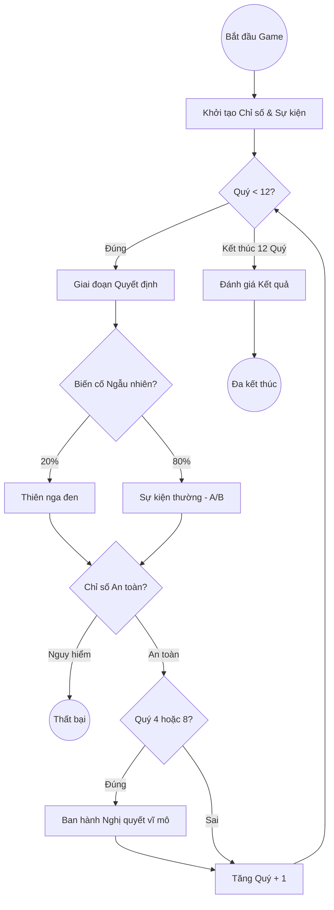

# 🎮 Tài liệu Kỹ thuật: Hệ thống Mô phỏng Policy-Sim (Minigame)

Tài liệu này tổng hợp toàn bộ thông tin về luồng xử lý, giao diện (UI) và logic cốt lõi của minigame **Policy-Sim** trong dự án MLN122.

---

## 📅 1. Luồng Trò chơi (Game Flow)

Trò chơi được thiết kế theo mô hình **12 Quý (12 Quarters)**, mô phỏng một nhiệm kỳ điều hành vĩ mô.

### Sơ đồ quy trình:


---

## 📊 2. Hệ thống Chỉ số (Stats System)

Sức khỏe của nền kinh tế được đo lường qua 4 chỉ số cốt lõi (`stats`):

| Chỉ số | Tên gọi | Ý nghĩa | Ngưỡng thua |
| :--- | :--- | :--- | :--- |
| **CPI** | Lạm phát | Ổn định giá cả hàng hóa | `>= 8.0%` |
| **COV** | An sinh xã hội | Độ phủ và chất lượng dịch vụ công | `<= 70%` |
| **ROIC** | Hiệu quả vốn | Khả năng sinh lời của Tập đoàn NN | `<= -5.0%` |
| **BUD** | Ngân khố | Dư địa tài khóa (Tỷ USD) | `<= 0` |

---

## 🧠 3. Logic Quyết định & Biến cố

### A. Sự kiện Chính (GAME_EVENTS)
Mỗi quý, hệ thống rút ngẫu nhiên một sự kiện từ danh sách (EVN, PVN, VNPT, NHNN, TKV, VNA). Mỗi sự kiện có 2 lựa chọn (Option A/B) với các tác động (`impact`) khác nhau.

**Cấu trúc dữ liệu mẫu:**
```javascript
{
  id: 1, 
  entity: "EVN",
  title: "Khủng hoảng thiếu điện",
  options: [
    { label: "Giữ giá", impact: { cpi: 0, cov: 2, roic: -4.5, bud: -10 } },
    { label: "Tăng giá", impact: { cpi: 2.5, cov: -5, roic: 3.0, bud: 0 } }
  ]
}
```

### B. Thiên nga đen (BLACK_SWANS)
Xuất hiện với tỉ lệ **20%** mỗi quý. Đây là các biến cố cực đoan (Bão lũ, Đứt gãy vận tải, Đột phá công nghệ) gây tác động ngay lập tức mà không có lựa chọn né tránh.

### C. Đạo luật vĩ mô (MACRO_POLICIES)
Tại Quý 4 và Quý 8, người chơi được ban hành 1 trong 3 nghị quyết:
1. **Đối tác Công - Tư (PPP)**: Buff vĩnh viễn giúp tăng `roic` mỗi khi bạn đưa ra quyết định có lợi cho `cov`.
2. **Thiết quân luật Bình ổn giá**: Tự động trừ `cpi` mỗi quý nhưng cũng trừ `roic`.
3. **Sắc thuế Thu lợi Siêu ngạch**: Cộng ngay lập tức +40 Tỷ USD nhưng trừ mạnh An sinh.

---

## 🎨 4. Giao diện & Thành phần UI (UI Components)

Hệ thống UI được xây dựng với các thành phần chuyên biệt tại `src/game/components`:

1.  **[EventScene.jsx](file:///c:/Users/anhev/Desktop/mln/src/game/components/EventScene.jsx)**: Dựng bối cảnh 3D-like, hiệu ứng thời tiết (mưa, sét) và mini-game ổn định tín hiệu.
2.  **[DecisionCard.jsx](file:///c:/Users/anhev/Desktop/mln/src/game/components/DecisionCard.jsx)**: Hiển thị các thẻ quyết định với preview chỉ số sẽ thay đổi.
3.  **[QuarterTimeline.jsx](file:///c:/Users/anhev/Desktop/mln/src/game/components/QuarterTimeline.jsx)**: Thanh tiến độ trực quan hóa lộ trình 12 quý.
4.  **[OutcomePanel.jsx](file:///c:/Users/anhev/Desktop/mln/src/game/components/OutcomePanel.jsx)**: Bảng thống kê kết quả sau mỗi quyết định.
5.  **[ImpactPreview.jsx](file:///c:/Users/anhev/Desktop/mln/src/game/components/ImpactPreview.jsx)**: Hoạt ảnh minh họa các chỉ số đang dao động.

---

## 🔊 5. Engine Âm thanh (Audio Logic)

Dự án sử dụng **Web Audio API** (synth procedural) để tạo âm thanh mà không cần file audio bên ngoài:

- **BGM**: Nhạc nền ambient tạo từ sóng Sin tần số thấp (Sub-bass) mang lại không khí chuyên nghiệp, căng thẳng.
- **SFX**: Các phản hồi âm thanh khi click, hover, hoặc khi có biến cố (Alert).

---

## 💾 6. Lưu trữ & Trạng thái (Technical Implementation)

- **State Management**: Toàn bộ logic nằm trong `PolicySimGame` component tại `App.jsx`.
- **Lưu trữ**: Trạng thái được đồng bộ với `localStorage` (`policySimSave`), cho phép tiếp tục chơi sau khi tải lại trang.
- **Tính toán**: Logic `commitTurn` xử lý việc cộng dồn chỉ số, áp dụng Buff chính sách và kiểm tra điều kiện kết thúc (Game Over/Win).

---
*Tài liệu được tổng hợp cho dự án Vietnam State Economy Interactive Simulation.*
